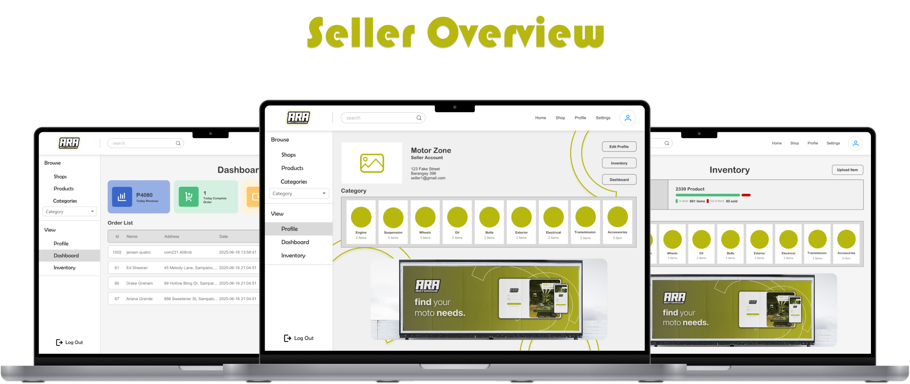

  

---
>**find** your  
>motor **needs.**
---

## Table of Contents

- [Table of Contents](#table-of-contents)
- [🚀 Project Overview](#-project-overview)
- [✨ Features](#-features)
  - [🔧 Admin Side](#-admin-side)
  - [🎯 User Side](#-user-side)
- [📸 Screenshots](#-screenshots)
- [🤝 Developer](#-developer)
- [🏗️ Project Structure](#️-project-structure)
- [📬 Contact / Support](#-contact--support)

---

## 🚀 Project Overview

**ARA Motorhub** A desktop application for managing motorcycle parts inventory. Customers can browse parts, request items, and check availability across multiple stores. Includes dedicated admin and seller dashboards for efficient stock control. Backed by a MySQL database server via XAMPP and phpMyAdmin.

This was our finals in Advanced Database Class

---

## ✨ Features

### 🔧 Admin Side
- CRUD Operations on:
  - Admin, User, Store  
  - Inventory, Product, Category  
  - No Stock, Available Stock, Cart  

### 🎯 User Side
- Step 1 and Step 2 Regisration
- Customer Main Home Page and Next Home Page
- Customer Buying Process
  - Look for product
  - Add to cart
  - Spinner Quantity
  - View Shop
  - Payment with Card
  - Checkout

---

## 📸 Screenshots

 

  

 

  

 
 

  

 
 

  

---

## 🤝 Developer

  <table>
    <tr>
      <td width="200" align="center" valign="top">
        
        

          <strong>Carl Zeus Anastacio</strong> 
          <em>Project Lead • Project Manager • UI/UX Designer • Front-end Developer • Back-end Developer • Documentation • Database Designer</em>
        

      </td>
  </table>

---

## 🏗️ Project Structure

<pre> <code>
ogcreate-aramotorhub/
├── README.md
├── ARAMotorhub/
│   ├── bin/
│   │   ├── com/
│   │   │   └── ogcreate/
│   │   │       └── app/
│   │   │           ├── controllers/
│   │   │           │   ├── admin/
│   │   │           │   ├── auth/
│   │   │           │   ├── customer/
│   │   │           │   ├── settings/
│   │   │           │   └── store/
│   │   │           └── database/
│   │   └── resources/
│   │       ├── assets/
│   │       ├── css/
│   │       ├── fonts/
│   │       └── fxml/
│   │           ├── admin/
│   │           ├── auth/
│   │           ├── customer/
│   │           ├── settings/
│   │           └── store/
│   ├── lib/
│   ├── src/
│   │   ├── com/
│   │   │   └── ogcreate/
│   │   │       └── app/
│   │   │           ├── controllers/
│   │   │           │   ├── admin/
│   │   │           │   ├── auth/
│   │   │           │   ├── customer/
│   │   │           │   ├── settings/
│   │   │           │   └── store/
│   │   │           └── database/
│   └── resources/
│       ├── assets/
│       ├── css/
│       ├── fonts/
│       └── fxml/
│           ├── admin/
│           ├── auth/
│           ├── customer/
│           ├── settings/
│           └── store/
│   └── .vscode/
├── readme/
└── sql-database/
</code> </pre>

---

## 📬 Contact / Support

For inquiries, suggestions, or support, please contact:

- **Instagram**: [@_ogcz](https://www.instagram.com/_ogcz/)
